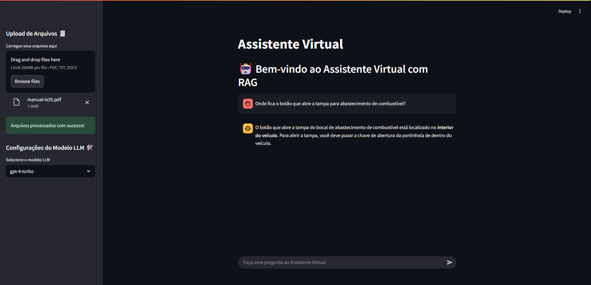
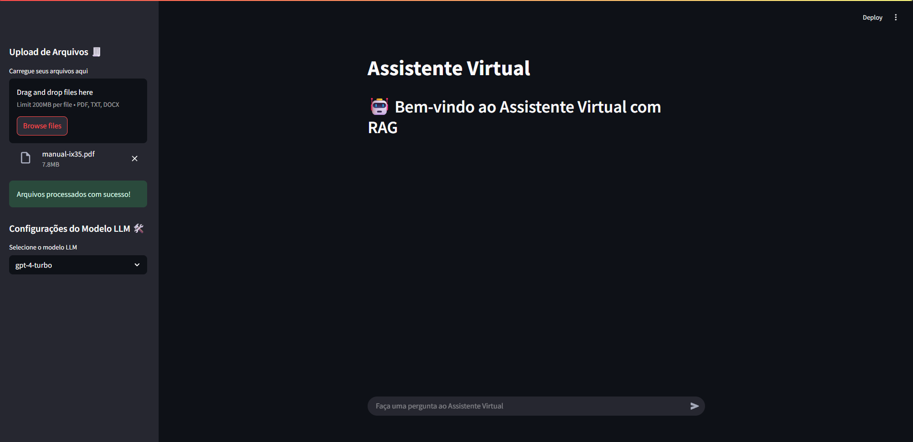

# 🧑‍💻 Assistente RAG

Bem-vindo ao **Assistente RAG**!  
Este projeto é uma implementação de um assistente inteligente utilizando a técnica de Retrieval-Augmented Generation (RAG), integrando processamento de linguagem natural com busca em bases de conhecimento para respostas mais precisas e contextuais.

---

## 🚀 Funcionalidades

- Processamento e indexação de documentos
- Busca semântica eficiente
- Geração de respostas contextuais com LLMs
- Interface amigável para interação com o assistente
- Fácil integração e personalização

---

## 📦 Estrutura do Projeto

```
assistent_rag/
│
├── assets/           # Imagens e recursos estáticos
├── data/             # Base de dados e documentos
├── src/              # Código-fonte principal
├── .env.example      # Exemplo de variáveis de ambiente
├── requirements.txt  # Dependências do projeto
└── README.md         # Este arquivo
```

---

## 🖼️ Demonstrações

```markdown


```

---

## ⚙️ Como rodar o projeto

1. **Clone o repositório:**
   ```
   git clone https://github.com/thiagoalmeida37/assistent_rag.git
   cd assistent_rag
   ```

2. **Crie e ative um ambiente virtual:**
   ```
   python -m venv venv
   .\venv\Scripts\activate
   ```

3. **Instale as dependências:**
   ```
   pip install -r requirements.txt
   ```

4. **Configure as variáveis de ambiente:**
   - Copie o arquivo `.env.example` para `.env` e preencha com suas credenciais.

5. **Execute a aplicação:**
   ```
   python src/main.py
   ```

---

## 📝 Como contribuir

1. Faça um fork do projeto
2. Crie uma branch para sua feature (`git checkout -b feature/nova-feature`)
3. Commit suas alterações (`git commit -m 'feat: minha nova feature'`)
4. Faça push para a branch (`git push origin feature/nova-feature`)
5. Abra um Pull Request

---

## 📄 Licença

Este projeto está sob a licença MIT. Veja o arquivo [LICENSE](LICENSE) para mais detalhes.

---

<div align="center">
  Feito com ❤️ por [Seu
